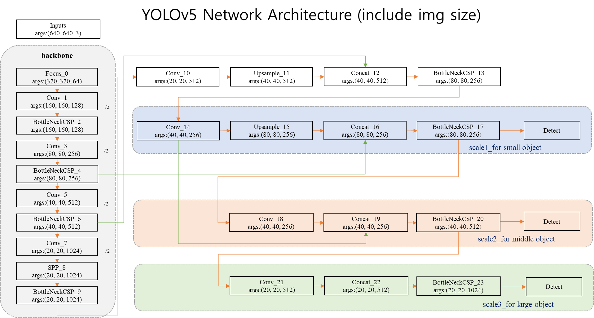

#YOLO v5 Xray object detection (한글 프로젝트)

- 연세대학교 인공지능 대학원 AiHub dataset을 이용한 Xray object detection 프로젝트의 결과  

----

##목적 

- 대학원에서 프로젝트를 수행하며 YOLO 알고리즘을 리서치를 한 결과 국내 자료 수 자체가 많지 않고 있다 하더라도 자료가 과거의 버전에 머물러 있습니다.    

- 외국의 자료들 역시 현재 버전에서 동작하는 자료가 많지 않고 파편화되어있어 해당 git repo를 통해 자료를 통합하여 제공하는 것에 1차 목적을 두고자 합니다.   

- 코드의 의미와 어디를 고치면 custom data를 Train하고 실제 활용할 수 있는지 Tutorial을 제공하고 Function별 한글 주석을 생성하는것이 본 프로젝트의 최종 목적입니다.   

----
##구조도

---
## 학습

~~~
python train.py --img 640 --batch 4 --epochs 30 --data ./data/custom/custom.yaml --cfg ./models/custom_5m.yaml --weights ./weights/yolov5m.pt
~~~
---

## 결과
model : custom_5m  
epochs: 100 epoch    

| Class                         | mAP@.5 | mAP@.5:.95: |
|-------------------------------|--------|-------------|
| all                           | 0.988  | 0.883       |

----

## 참조
yolov3(pytorch): https://github.com/ultralytics/yolov3

yolov4(c++): https://github.com/AlexeyAB/darknet

yolov5(pytorch): https://github.com/ultralytics/yolov5  

## Pre-Trained Data 
yolov5m.pt download  
$ python train.py --img 640 --batch 4 --epochs 30 --data ./data/custom/custom.yaml --cfg ./models/custom_5m_p2.yaml --weights 'weights/yolov5m.pt'
'''

## yolov5m.pt download
https://github.com/ultralytics/yolov5/releases/download/v3.0/yolov5m.pt

